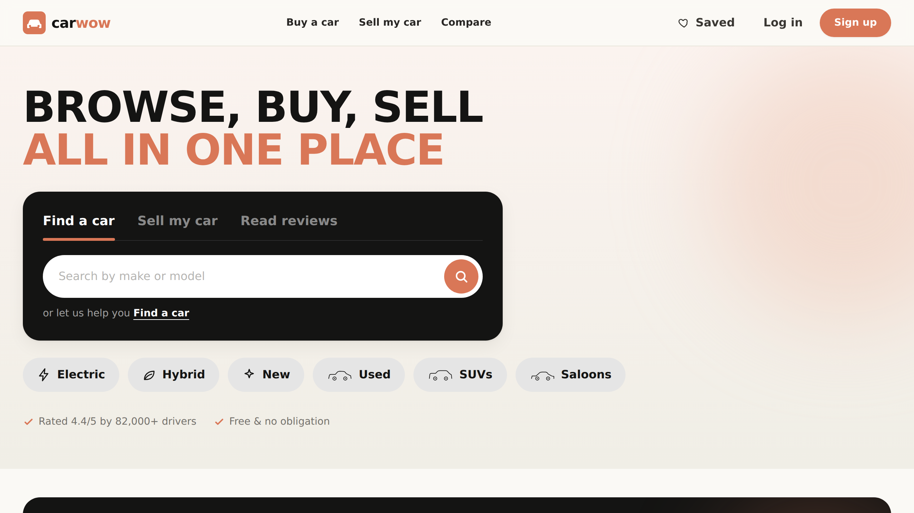
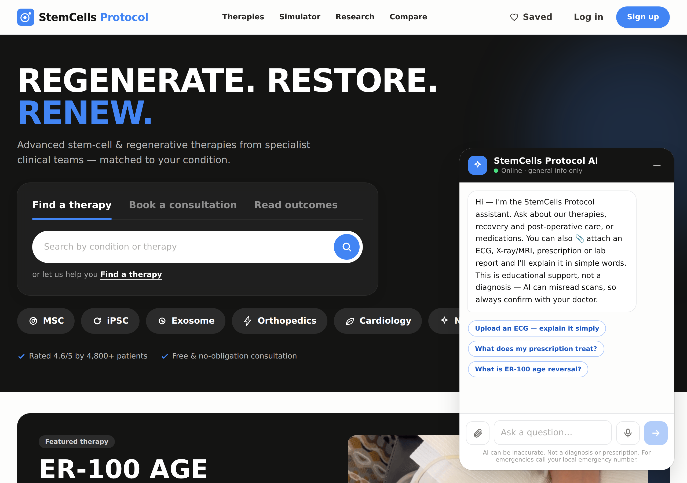
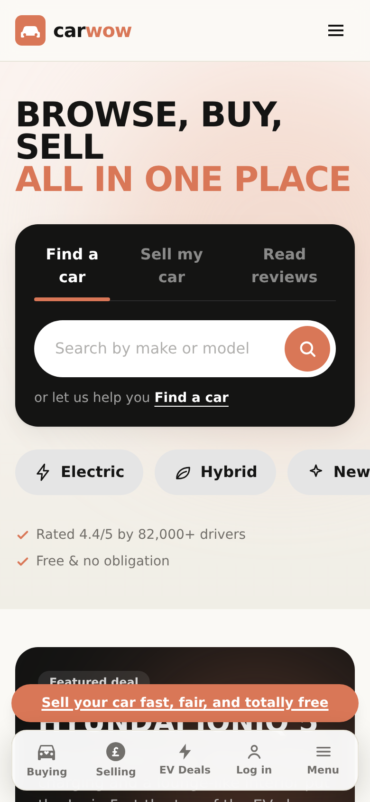
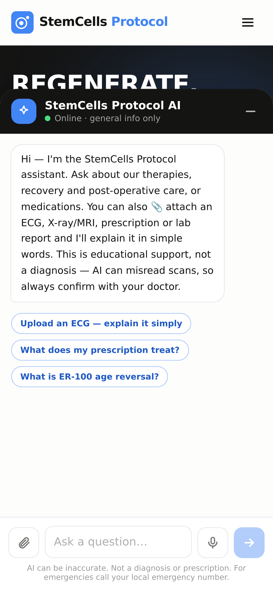

<div align="center">

# 🧬 StemCells Protocol

### A full-stack stem-cell & regenerative-therapies hospital site — explore, compare & book advanced cell therapies across every department

*A modern marketplace-style experience reimagined for regenerative medicine: browse therapies by department, compare protocols, review clinical-trial research and book a consultation — in a clean clinical blue-and-white theme.*

<br/>

### 🌐 Website: **[stemcellsprotocol.com](https://stemcellsprotocol.com)**

[](https://stemcellsprotocol.com)
[](https://stemcellsprotocol.com)

[](LICENSE)
[](https://nodejs.org)
[](https://react.dev)
[](https://www.typescriptlang.org)
[](https://vitejs.dev)
[](https://tailwindcss.com)
[](https://expressjs.com)
[](https://www.sqlite.org)

</div>

> ⚕️ **Medical disclaimer.** This is an **illustrative demo / portfolio project — not a real clinic**. Every department, therapy, cost, success rate, trial phase and patient review is **sample data for demonstration only**. Nothing here is medical advice or a treatment offer. Many stem-cell therapies shown are **investigational**; always consult a qualified clinician.

---

## 🌐 Live site

The **full interactive app** is live on a custom domain (a backend-free build that runs entirely in the browser, hosted on GitHub Pages), so you can click through every page, flow and animation:

### 👉 **https://stemcellsprotocol.com**

> Therapy cards use real, **bundled** stem-cell clinic & lab photography (cryo storage, cleanrooms, cell processing) — no external image CDN — with a department glyph as a fallback, so cards always load cleanly.

---

## 📸 Screenshots

|  |  |
|---|---|
| **Home + AI assistant** | **AI chat — ask, or attach an ECG/scan** |
|  |  |
| **Home (mobile)** | **Chat (mobile)** |
|  |  |

---

## 🤖 AI care assistant

A theme-matched, collapsible chat widget on the homepage, powered by **Claude** through a secure **Cloudflare Worker** proxy — so the API key never touches the browser.

- **Ask anything medical** — therapies, recovery & post-operative care, medications, primary/emergency care, in plain language.
- **📎 Upload & explain** — attach an **ECG, X-ray/MRI, prescription or lab report** and get a structured read plus a simple patient summary (*In simple terms · Is it serious? · What you can do next*).
- **🎤 Voice input** — patients can speak their question (Web Speech API).
- **🌍 Multi-language** — replies in the same language the patient writes in.
- **🧠 Conversation memory** — follow-up questions in context.
- **💾 Save the chat** — export the conversation as **PDF, Word (.doc) or text**.
- **🛡️ Safe & guarded** — streaming replies with markdown, per-IP rate limiting, a monthly spend cap, and clear "not a diagnosis — confirm with your doctor" framing that routes emergencies to urgent care.

> The chat proxy lives in [`chat-worker/`](chat-worker/) and auto-deploys via Cloudflare Workers Builds; the static site auto-deploys via GitHub Pages.

---

## 📋 Table of contents

- [✨ Overview](#-overview)
- [🧪 How the platform works](#-how-the-platform-works)
- [🧩 Pages & features](#-pages--features)
- [🩺 Departments & therapies](#-departments--therapies)
- [🛠 Tech stack](#-tech-stack)
- [🏗 Architecture](#-architecture)
- [⚡ Quickstart](#-quickstart)
- [🔥 Dev mode](#-development-mode-hot-reload)
- [🌍 Static / Pages build](#-static--github-pages-build)
- [📡 API reference](#-api-reference)
- [🗂 Project structure](#-project-structure)
- [📝 License](#-license)

---

## ✨ Overview

**StemCells Protocol** recreates a modern medical-marketplace experience end to end. It's a single-page React app on top of a REST API, with a **backend-free "static" mode** that lets the entire thing run in the browser for the GitHub Pages demo.

The homepage is built **section-by-section** — a tabbed hero, featured therapy, browse-by-category & by-department, "regenerative therapies trending", patient reviews, guides, videos and a dark footer — and the primary journeys each have their own page: **Therapies**, **Research & Trials**, **Care Packages** and **Book a Consultation**, plus therapy detail, compare and auth.

> 💡 A portfolio / learning project. All therapy data, costs, outcomes and quotes are illustrative, generated from sample data.

---

## 🧪 How the platform works

The StemCells Protocol platform turns a patient's own genome into a personalised, age-reversing exosome therapy in **four steps**:

| Step | Stage | What happens |
|:---:|---|---|
| **1** | 🧬 **Digital DNA** | A DNA test sequences the patient's complete genome and converts it into a secure **digital DNA** file. |
| **2** | 🧠 **Protocol Simulator** | The digital DNA is fed into the StemCells Protocol **De novo LLM**, which invents **novel biomolecules** to reverse cellular ageing — and reawaken dormant, aged stem cells into younger ones. |
| **3** | 🧫 **In-vitro production** | The novel biomolecules are cultured and **multiplied in vitro** in the laboratory. |
| **4** | 💉 **Exosome IV therapy** | The personalised **biomolecule exosomes** are delivered to the patient by **IV infusion**, who is then monitored for weeks to months during a restorative stay in **Ooty**. |

---

## 🧩 Pages & features

**🏠 Home** — section by section:
- Bold hero with a **tabbed search card** (Find a therapy / Book a consultation / Read outcomes) and category chips
- **Featured therapy**, top-rated therapies, **browse by category & department** (custom SVG icons)
- **Regenerative therapies trending**, patient **reviews slider**, popular therapies, guides & videos and an **FAQ** accordion

**🩺 Therapies** — a "What are you looking for?" chooser (By department / Established therapies / Clinical trials / Compare).

**🔬 Research & Trials** — therapies **under investigation**, latest trial openings slider, filterable investigational-therapy grid, each clearly badged as experimental.

**💷 Care Packages & Financing** — why-choose blocks, three-step how-it-works, interactive **care-tier tabs** (Essential / Standard / Premium), financing tips and FAQs.

**🗓️ Book a Consultation** — describe your condition → indicative starting cost + **matched specialist clinics**, plus a **StemCells Protocol vs going direct** comparison table, consultation FAQs and patient guides.

**📄 Therapy detail** — department icon, overview, full **clinical details** (cell source, delivery route, success rate, sessions, recovery, follow-up, cell dose, trial phase), cost & financing, save button, related therapies, and a status badge for investigational therapies.

**⚖️ Compare** — up to 3 therapies side by side; best value per row highlighted.

**🔎 Browse** — search + filters (department, category, cell source, delivery route, status, max cost), sorting, pagination, URL-synced.

**🔐 Accounts** — login (Continue with Google, email/password), register, JWT auth, and ❤️ **saved therapies**.

**📱 Mobile-first** — a native-style **floating bottom nav** (Therapies / Consult / Research / Account / Menu) and a full-screen **menu** with dropdown accordions.

---

## 🩺 Departments & therapies

A curated catalogue of **58 illustrative therapies** across **11 departments** — **Age Rejuvenation, Diabetes, HIV, Autoimmune, Dental, Orthopedics, Cardiology, Gastroenterology, Neurology, Pulmonology** and **Cosmetic** — spanning six regenerative **categories** (MSC, HSC, iPSC, Exosome, Immune-cell, PRP).

Each therapy is labelled **Available** (established) or **Under research** (investigational / clinical-trial), with a cell source (autologous / allogeneic), delivery route, indicative cost, and illustrative clinical metrics.

> The single source of truth is [`server/src/db/therapies.js`](server/src/db/therapies.js); the static demo dataset is generated from it via `node scripts/gen-staticdata.mjs`, so the two never drift.

---

## 🛠 Tech stack

The live site at **[stemcellsprotocol.com](https://stemcellsprotocol.com)** runs **fully serverless** — a static React build on GitHub Pages, with Cloudflare Workers and Supabase providing the dynamic backend. (The original Node/Express + SQLite server is still in the repo as an optional self-hosted full-stack mode — see the Architecture section.)

| Layer | Technology |
| ----- | ---------- |
| **Front end** | React 18 · TypeScript · Vite · Tailwind CSS · React Router |
| **Hosting / CI** | GitHub Pages (static build from `/docs`) · custom domain **stemcellsprotocol.com** · auto-deploy on push |
| **AI assistant** | Anthropic **Claude** (`claude-sonnet-4-5`) via a **Cloudflare Worker** proxy — the API key lives only as an encrypted Worker secret, never in the browser · SSE streaming · image/PDF uploads (ECG, X-ray, MRI, prescriptions, lab reports) · voice input & 20+ languages (Web Speech API) |
| **Serverless edge** | **Cloudflare Workers** (chat proxy + email-alert endpoint) · **Workers KV** (per-IP rate limiting) · **Workers Builds** (Git auto-deploy) |
| **Database & Auth** | **Supabase** — Postgres · **Auth** (email/password + Google OAuth, PKCE) · **Row-Level Security** · `pg_net` triggers |
| **Email alerts** | **Resend** — new consultations fire a Supabase `pg_net` trigger → Worker `/notify` → email to the clinic inbox |
| **Analytics** | **Cloudflare Web Analytics** (privacy-friendly, cookieless) · in-app admin dashboard (visits, consultations, sign-ups, chat) with date filters, search, CSV export & charts |
| **Optional back end** | Node.js · Express · SQLite (`better-sqlite3`) · JWT (`jsonwebtoken`) · `bcryptjs` — self-hosted full-stack mode |
| **Imagery** | **Bundled** real clinic/lab photography with an inline-SVG glyph fallback — no external image CDN |

---

## 🏗 Architecture

```text
                ┌──────────────────────────────────────────┐
  Browser  ──►  │            Node.js (Express)             │
 (React SPA)    │   /api/*  ──►  routes ──► better-sqlite3 ──► SQLite
                │   /*      ──►  serves the built client    │
                └──────────────────────────────────────────┘
                          one server · one port (4000)

  GitHub Pages demo  ──►  same React app, VITE_STATIC=true
                          (in-browser mock API + localStorage, no backend)
```

---

## ⚡ Quickstart

**Prerequisites:** [Node.js 18+](https://nodejs.org) (includes npm) and Git.

```bash
git clone https://github.com/sanjaydoc/Stemcellsprotocol.git
cd Stemcellsprotocol
npm install       # installs root, server & client
npm run seed      # seed the sample therapy catalogue
npm start         # builds the client and starts the single server
```

Open **http://localhost:4000**.

> ✅ **One command:** `npm start` builds the React app and boots the Express server, which serves the UI **and** the `/api` routes together on port **4000**.

---

## 🔥 Development mode (hot reload)

```bash
npm run dev
```

| Service | URL |
| ------- | --- |
| API (Express, `--watch`) | http://localhost:4000 |
| Client (Vite dev server, proxies `/api`) | http://localhost:5173 |

---

## 🌍 Static / GitHub Pages build

The live demo is a **backend-free** build: the client is compiled with `VITE_STATIC=true`, swapping the HTTP API for an in-browser mock (embedded catalogue + `localStorage`) and using `HashRouter`.

```bash
npm run build:pages   # builds the static client into ./docs
```

Commit the updated `docs/` — GitHub Pages serves it from **Settings → Pages → Deploy from a branch → `main` / `/docs`**.

---

## 📡 API reference

Base URL: `http://localhost:4000/api`

> The database schema is inherited from the original marketplace app and **repurposed** for therapies (e.g. `make` → department, `model` → therapy, `condition` → available/under-research), so endpoints keep their original paths.

| Method | Endpoint | Auth | Description |
| ------ | -------- | :--: | ----------- |
| `GET` | `/health` | – | Health check |
| `GET` | `/cars` | – | List therapies — `search, make, body_type, fuel_type, transmission, condition, min_price, max_price, sort, page, limit` |
| `GET` | `/cars/filters` | – | Distinct filter values + cost range |
| `GET` | `/cars/:id` | – | A single therapy + related therapies |
| `POST` | `/auth/register` · `/auth/login` | – | Auth → `{ token, user }` |
| `GET` | `/auth/me` | ✅ | Current user |
| `POST` | `/sell` | – | Submit a consultation enquiry → indicative cost + matched specialist clinics |
| `GET` | `/sell/:id` | – | A submission + its matched clinics |
| `GET` · `POST` · `DELETE` | `/saved` · `/saved/:carId` | ✅ | List / save / un-save therapies |

---

## 🗂 Project structure

```text
Stemcellsprotocol/
├── package.json          # root scripts (start, build:pages, dev, seed)
├── scripts/
│   ├── build-pages.mjs   # builds the static client into ./docs
│   └── gen-staticdata.mjs# regenerates the static dataset from the seed
├── docs/                 # published GitHub Pages build
├── server/               # Express + SQLite API
│   └── src/  index.js · db/ (therapies.js, seed.js) · middleware/ · routes/
└── client/               # React + Vite + Tailwind app
    └── src/
        ├── pages/        # Home, Buying, EvDeals, CarInsurance, Sell, CarDetail, Compare, Browse, Login, …
        ├── components/   # Navbar, MobileNav, CarCard, CarImage, BrandLogo, icons, Footer, …
        ├── context/      # Auth + Saved providers
        └── api/          # client, mock API, static data
```

---

## 📝 License

Released under the [MIT License](LICENSE).

<div align="center">

Built with ❤️ using React, Vite, Tailwind CSS &amp; Node.js. · *Illustrative demo — not medical advice.*

</div>
