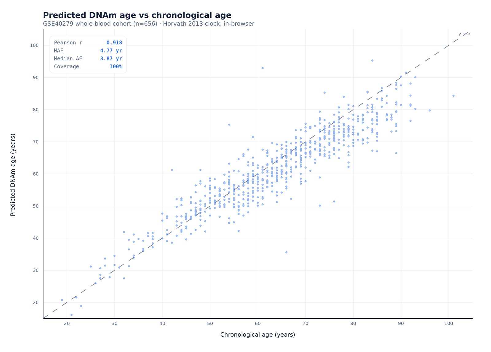

# Summary

`StemCells Protocol Simulator` is a browser-based tool that estimates a person's
**epigenetic (biological) age** from a DNA-methylation profile and presents it, together
with clearly-labelled illustrative therapy-planning models, in a single guided workflow.
The epigenetic-age computation is a faithful TypeScript implementation of the Horvath
(2013) multi-tissue clock [@horvath2013] and runs **entirely on the user's device** — the
methylation file is never uploaded to a server. The same code powers a public educational
website and an offline research build. This paper describes the tool and validates its
epigenetic-age estimates against a public reference cohort (GSE40279, n=656), reproducing
reference accuracy: Pearson r = 0.918, mean absolute error 4.77 years, median 3.87 years.
Only the epigenetic-age computation is validated; the accompanying reprogramming,
tumorigenicity and cellular-outcome modules are explicitly illustrative planning heuristics,
not validated predictors.

# Statement of need

Epigenetic clocks are now central to ageing and regenerative-medicine research, but
running them typically requires an R/Python environment and uploading sensitive genomic
data to a third-party service. There is a gap for a **zero-install, privacy-preserving**
implementation that a clinician, researcher, or informed patient can run in a web browser,
and that is explicit about the difference between a *measured* quantity (biological age
from a validated clock) and *illustrative* forward-looking models (e.g. partial-
reprogramming or cell-therapy projections). `StemCells Protocol Simulator` fills that gap:
it computes epigenetic age client-side from either Illumina array beta values or bisulfite-
sequencing (`.cov`/bedGraph) output, and wraps the result in a transparent, disclaimered
planning interface aimed at making users better-informed rather than replacing clinical
judgement.

# Functionality

- **Input:** Illumina 450K/EPIC array beta CSV (cg IDs) or WGBS/RRBS coverage files
  (`.cov`, bedGraph, bedMethyl); an integrated converter maps genomic-coordinate
  methylation onto the clock's CpGs (hg38).
- **Epigenetic age:** the Horvath (2013) 353-CpG clock, computed in-browser, with CpG
  coverage reporting and age-acceleration relative to chronological age.
- **Illustrative planning models (explicitly not validated):** partial-reprogramming and
  tissue-regeneration projections, an OSK/AAV construct or IV-exosome carrier sketch, a
  per-patient tumorigenicity and immunogenicity risk envelope, and a variant-informed
  cellular-outcome cartoon. These are deterministic planning heuristics presented as model
  estimates, **not** measured or clinical outcomes.
- **Output:** an on-screen animated run and an exportable PDF report.
- **Privacy:** all computation is client-side; no methylation data leaves the browser.

# Validation

We validated the epigenetic-age estimator — the tool's measured core — against
**GSE40279** [@hannum2013], a public whole-blood Illumina 450K cohort of 656 individuals
with known chronological ages, using the bundled `scripts/bench-clock.ts` harness, which
calls the *same* production `predict()` function the application uses.

| Metric | Value |
|---|---|
| Samples evaluated | 656 |
| Mean CpG coverage | 100% |
| Pearson r (predicted vs chronological age) | 0.918 |
| Mean absolute error | 4.77 years |
| Median absolute error | 3.87 years |

These figures are consistent with the accuracy Horvath (2013) reports for this clock on
healthy cohorts (median error ≈ 3.6 years), confirming that the in-browser implementation
reproduces the reference method. A predicted-vs-chronological-age scatter plot is shown in
\autoref{fig:validation}.

# Limitations

Only the **epigenetic-age computation** is validated here. The reprogramming,
tumorigenicity, immunogenicity, and cellular-outcome modules are illustrative planning
heuristics, not validated predictors, and the tool labels them as such throughout; they
must not be interpreted as clinical results or treatment recommendations. The current
release implements a single clock (Horvath 2013); multi-clock support (e.g. Hannum,
PhenoAge) is planned to remove single-estimator dependence.

# Availability

Source code and the validation harness are available at
<https://github.com/sanjaydoc/Stemcellsprotocol>; the tool runs at
<https://stemcellsprotocol.com>. This release is archived on Zenodo
(DOI: [10.5281/zenodo.22760374](https://doi.org/10.5281/zenodo.22760374)).
The validation dataset GSE40279 is available from NCBI GEO.

# Acknowledgements

We thank the authors of GSE40279 for making their cohort publicly available.

# References
